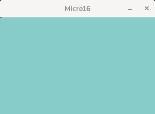

# Micro16

Yet another 16bit fantasy computer emulator!

The computer has a 16-bit fictional CPU. For a detailed reference on how it works, see
[The CPU manual](docs/cpu-manual.md). Memory has basically two levels: CPU registers and 4 banks of 64KB of RAM each
(Total 256KB). Since some parts of the memory are dedicated, general purpose memory is actually less than that. For
details on how to compile it, please see [Compiling and running](docs/how-to-compile.md).

### Examples

`$ micro16 examples/led-blink.micro16`

