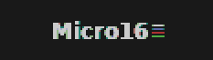
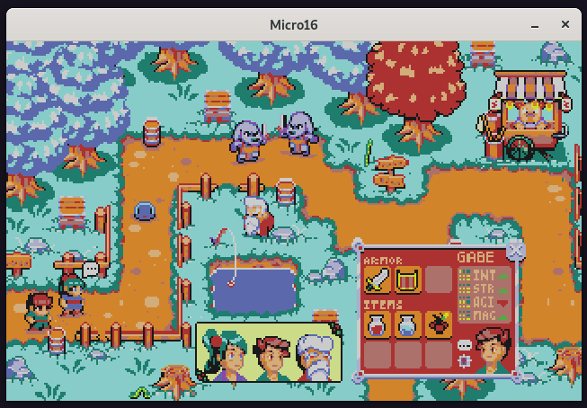
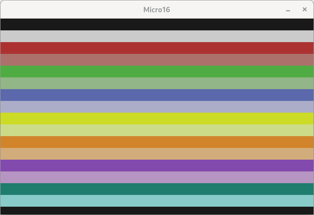

  

Yet another 16bit [fantasy computer](https://github.com/topics/fantasy-computer)

The computer has a 16-bit fictional CPU. For a detailed reference on how it works, see
[The CPU manual](docs/cpu-manual.md). There's also an [ISA documentation file](docs/isa.md).
Memory has basically two levels: CPU registers and 4 banks of 64KB of RAM each (Total 256KB). Persistent disk is
planned, but not yet implemented. Since some parts of the memory are dedicated, general purpose memory is actually less
than that. For details on how to compile it, please see [Compiling and running](docs/how-to-compile.md).

There's an [assembler](src/assembler/) software, so that you don't need to write programs directly in machine
code. A C-like language and a compiler is planned, but not yet implemented. Some example programs can be found in the
[examples/](examples/) folder.

### Examples

#### Pixel art display

There's a [pixel-art display generator script](tools/pixel_art_to_m16data/pa_to_m16data.py) available in python, where you can provide a 320x200 image, and it'll
convert it's color palette to [Micro16 color pallete](docs/cpu-manual.md#video) and generate the assembly file to
display it on the Micro16 (You just need to translate it using the [assembler](src/assembler/)).

Script usage:

    $ python3 pa_to_m16data.py <filename.png>

Example:

    $ micro16_asm examples/pixel_art_example.m16asm out.micro16
    $ micro16 out.micro16

[View assembly for this example](examples/pixel_art_example.m16asm)

⚠ The art on the example is licensed under CC0 1.0, and the source can be found [here](https://bakudas.itch.io/generic-rpg-pack).

#### Brainfuck compiler

There's a [brainfuck compiler](src/brainfuck/README.md) available, capable of translating a program written in the
brainfuck language to the micro16 assembly:

    $ micro16_bf examples/example.bf out.m16asm
    $ micro16_asm out.m16asm out.micro16
    $ micro16 out.micro16

[View .bf file for this example](examples/example.bf)

#### Led blink

    $ micro16_asm examples/led_blink.m16asm out.micro16
    $ micro16 out.micro16

[View assembly for this example](examples/led_blink.m16asm)

